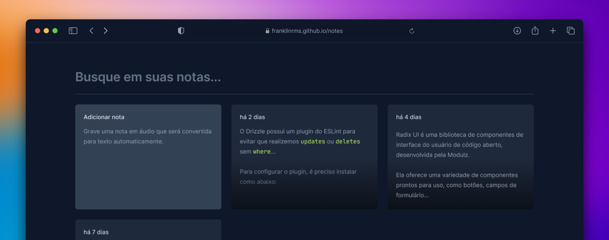

# Notes

Aplicação de estudo para criar e gerenciar notas, utilizando React, TypeScript, Tailwind e a SpeechRecognition API.

## Executando

Após clonar o repositório, acesse a pasta do projeto e execute os comandos abaixo:

```sh
npm install
npm run dev
```

Acesse http://localhost:5173 para visualizar a aplicação.